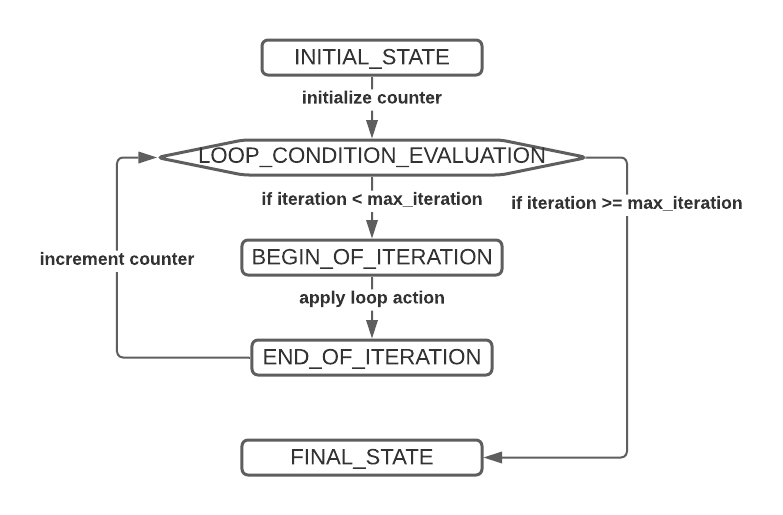

# state_machine_cpp library


The state_machine_cpp library is a library written in C++17 which permits the development
of algorithms by means of state-machines-like behaviors.
It aims to be used when, among others, one wants to achieve the following goals:
- have excessive control over the execution of an algorithm (i.e., step-by-step implementation)
- make available and highly customizable an algorithmic work to a larger community

To achieve these goals, algorithms are decomposed in a succession of states while the algorithmic flow
is enforced by so-called transitions from one state to another. This decomposition of algorithms makes it
possible to insert new states and new transitions to an existing algorithm without breaking the original
algorithm and to be able to rewrite any part of the algorithm which comprises: state or transition removal,
transition action overriding, transition flow overriding, algorithmic combination (i.e., sub-routines), etc.

Here is an example of the implementation of a for loop within the state-machine-like framework:



## Tutorials

Be sure to check out our amazing tutorials!
- [Basics: creating your first algorithm](https://hlefebvr.github.io/state_machine_cpp/t1_ForLoop.html)
- [Inheritance: modifying existing algorithms](https://hlefebvr.github.io/state_machine_cpp/t2_PowerLoop.html)
- [Layers: handling complex inheritance schemes](https://hlefebvr.github.io/state_machine_cpp/t3_DoubleLoop.html)
- [Organize your code!](https://hlefebvr.github.io/state_machine_cpp/t4_Organize.html)

You may also check our [documentation](https://hlefebvr.github.io/state_machine_cpp/)!

## Installation

### Dependencies

- For compiling: C++ (>=17), cmake (>=3.19), pthread
- For building the documentation: doxygen
- For compiling unitary tests: GoogleTest

#### Map implementation

When installing the library (see below), the compiler will evaluate the directive `#if __has_include(<robin_hood/robin_hood.h>)`.
If it evaluates to true, then the [robin hood](https://github.com/martinus/robin-hood-hashing) implementation of unordered_map will be used.
Otherwise, the STL will be used (i.e., `std::unordered_map`). (robin_hood is a header-only library that provides a fast implementation
of hash tables.)

### Installation

The following commands will install the library as a shared library. 

```shell
mkdir build
cd build
cmake -DBUILD_SHARED_LIBS=ON .. # to install as a static library, simply use: cmake ..
make
sudo make install
cat install_manifest.txt
```

### Linking with cmake

The state_machine_cpp installs a cmake configuration file so that it can be easily 
imported. Simply use the cmake function `find_package` to retrieve all imported targets.
Thus, you can use the following code to import state_machine_cpp:
```cmake
add_executable(<MY_TARGET> main.cpp)

find_package(state_machine_cpp REQUIRED)
target_link_libraries(<MY_TARGET> state_machine_cpp::state_machine_cpp)
```

### Building the documentation

To build the documentation, use doxygen from the root folder:
```shell
doxygen
```

### Comiling and running unit tests

To compile the tests, in your `build` directory:
```shell
cmake -DCOMPILE_TESTS=ON ..
make
```

Then run with
```shell
./tests/test_state_machine_cpp
```